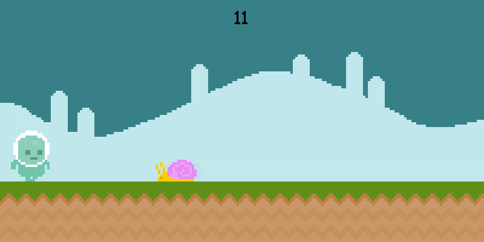

# Pixel Runner

An endless side-scrolling runner built in Python with pygame-ce.

You play a character running across an alien world that never stops moving. Snails crawl along
the ground and flies swoop in at head height — jump the ground ones, duck under nothing, and
survive as long as you can. The sky and the ground are both animated loops, so the world keeps
breathing behind you while you run.

Your score is simply **how many seconds you have stayed alive**.



---

## Gameplay

| Action | Key |
| --- | --- |
| Jump | `Space` |
| Pause | `Esc` |
| Restart / Quit | Click the on-screen buttons after losing |

- **Snails** spawn on the ground. **Flies** spawn in the air. Which one appears is random.
- One touch ends the run.
- The pause screen freezes the clock, so pausing never inflates your score.

## Running it

Requires Python 3.11 or newer.

```bash
pip install -r requirements.txt
```

```bash
python game.py
```

Run from the project root — assets are loaded from paths relative to the working directory.

## Project structure

| File | Responsibility |
| --- | --- |
| `game.py` | The whole game: sprite classes, the state machine, and the main loop |
| `gametest.py` | A standalone scratch file for prototyping the jump arc |
| `test.py` | A small experiment on the difference between class attributes and instance attributes |

## How it is built

**A three-state machine drives everything.** A single variable, `game_status`, decides what the
main loop draws each frame:

| `game_status` | Screen |
| --- | --- |
| `True` | Playing |
| `False` | Game over, with restart and quit buttons |
| `"Pause"` | Paused title screen |

The loop checks that variable once per frame and runs exactly one of the three branches. Adding a
new screen means adding a new branch, not rewriting the loop.

**Animation is a counter, not a timer.** Each sprite keeps a `counter` that ticks up every frame
and wraps around. Which frame of the walk cycle shows is decided by where that counter currently
sits — a cheap way to get animation without tracking real time.

```python
def player_animation(self):
    self.counter += 1
    if self.counter > 10:
        self.counter = 0
    if self.counter in range(0, 5):
        self.image = self.player_walk[0]
    elif self.counter in range(5, 10):
        self.image = self.player_walk[1]
```

**Gravity is one number.** Jumping sets `gravity` to `-20`, which pushes the player up. Every
frame after that adds `1` back to it, so the rise slows, reverses, and becomes a fall. The player
is clamped to the ground line at y = 300, which also doubles as the check for whether a second
jump is allowed.

**The score pauses honestly.** The timer records how long the game was paused and subtracts that
from the running total, so time spent on the pause screen does not count as time survived.

**Timed events spawn the world.** Two `pygame.USEREVENT` timers run independently — one spawns an
obstacle every 2.5 seconds, the other advances the background animation every 50 milliseconds.

## Built with

- Python 3.11
- [pygame-ce](https://pyga.me/) 2.5.5
